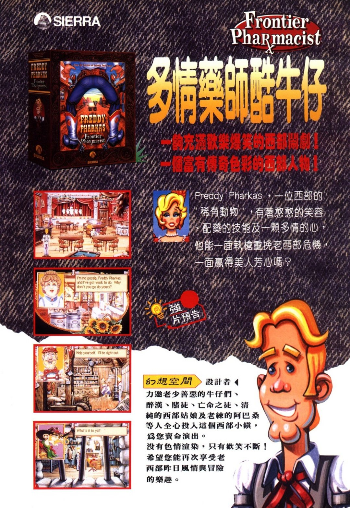
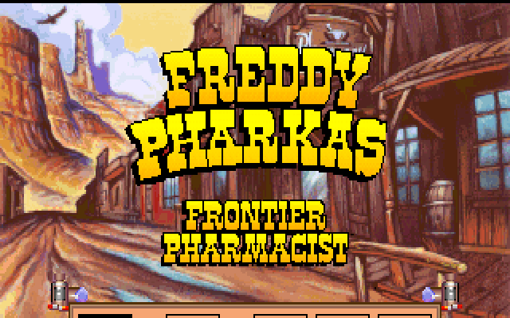
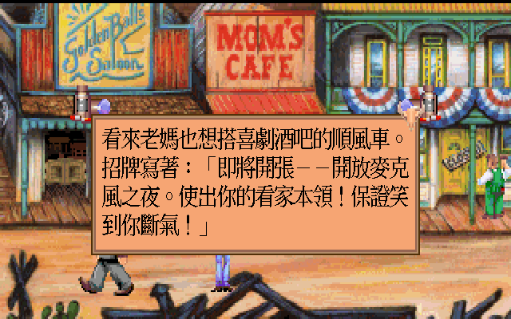
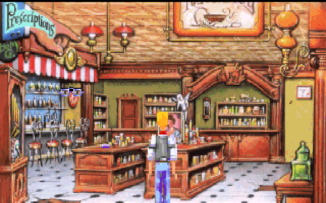
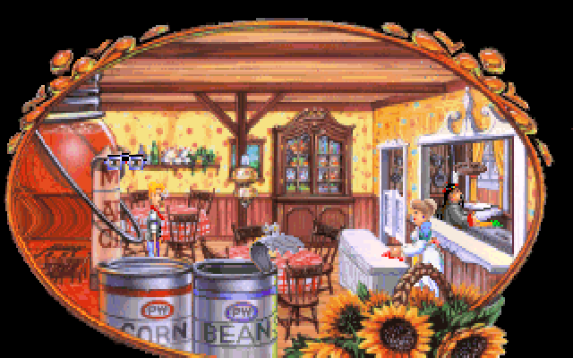

# 多情藥師酷牛仔 — 繁體中文化



<sub>《軟體世界》雜誌刊登的中文廣告，原件掃描（該頁未標示期別）。版權屬原刊與 Sierra On-Line，此處作為史料引用。</sub>

## 佛萊迪·法卡斯是誰

1993 年，Sierra On-Line 推出《Freddy Pharkas: Frontier Pharmacist》，
片尾字幕寫著「設計與編劇：Al Lowe 與 Josh Mandel」——Al Lowe 就是寫
《Leisure Suit Larry》的那位，遊戲盒封面上直接印著「From the Creator of
Leisure Suit Larry」。

主角佛萊迪·法卡斯生在聖路易，四歲那年他老爹就看出這孩子是「西部有史以來最神的
小神槍手」，長大後成了遠近馳名的槍手副警長。直到他對上亡命之徒「小鬼肯尼」——
對方拔槍比他快，一槍轟掉了他的右耳。佛萊迪帶著受創的自尊和缺一耳的身軀對天發誓
從此不碰槍，改去唸藥學，讀了五年拿到博士學位，搬到加州淘金小鎮粗金鎮
（Coarsegold）買下一間藥局。鎮上沒有人知道這位藥師的過去。

以上不是考據來的，是遊戲開場那首〈邊疆藥師之歌〉自己唱的：

> 他生於古老的聖路易，才四歲，老爹就看出他是西部有史以來，最神的小神槍手。
> （……）喔，那狠角色的名字叫肯尼，他拔槍比佛萊迪·法卡斯還快，
> 一槍轟掉佛萊迪的耳朵，證明誰才是真正的高手。
> （……）藥杵而非手槍，還有藥學。

<sub>歌詞為本專案譯文，節錄自遊戲開場〈The Ballad of the Frontier Pharmacist〉。</sub>

平靜日子沒過多久。鎮上開始出事：飲用水被人動了手腳、馬匹集體脹氣、蝸牛大舉搬家、
深夜還燒起一場大火；對外唯一的火車也因為一池莫名其妙的「黑水」停駛，
居民一戶接一戶搬走。偏偏就在這節骨眼上，鎮內小學新來的女教師潘妮洛普讓佛萊迪動了心，
而他最不敢讓她知道的，正是自己的老本行。

這款遊戲從頭到尾都在跟自己的設定開玩笑。藥局手冊裡塞滿刻意寫到唸不出來的偽化學名稱，
其中一款專治「舌頭瘀傷」——多半是因為病人想唸出藥名而傷到舌頭。整部作品把西部片的
英雄形象拿來反覆調侃，旁白比主角本人還嘴賤。

## 當年的廣告怎麼賣它

台灣當年以《多情藥師酷牛仔》的譯名上市，《軟體世界》雜誌刊過整頁彩色廣告，
並在 61、62 兩期連載攻略。上面那張就是廣告原件：中央是燙金般的中文譯名，
右上角壓著原版的 `Frontier Pharmacist` logo，左側直排四張遊戲截圖，
右下角探出佛萊迪本人那張憨笑的臉。兩行副標寫著：

> 一齣充滿歡樂爆笑的西部鬧劇！
> 一個富有傳奇色彩的西部人物！

正文這樣介紹主角：

> Freddy Pharkas，一位西部的「稀有動物」，有著憨憨的笑容、配藥的技能及一顆多情的心，
> 他能一面執槍重挽老西部危機，一面贏得美人芳心嗎？

廣告下半部另有一欄，抬頭是「幻想空間　設計者」——《幻想空間》是《Leisure Suit Larry》
當年的中文譯名，指的就是 Al Lowe，同一張廣告裡的遊戲盒封面也印著
「From the Creator of Leisure Suit Larry」。欄內文字是：

> 力邀老少善惡的牛仔們、醉漢、賭徒、亡命之徒、清純的西部姑娘及老練的阿巴桑等人
> 全心投入這個西部小鎮，為您賣命演出。沒有色情渲染，只有歡笑不斷！
> 希望您能再次享受老西部昨日風情與冒險的樂趣。

「沒有色情渲染」這句是有來由的。《軟體世界》的「遊戲獵人」專欄（作者 Gemini，
原刊第 114–115 頁）介紹這款遊戲時把話講得更白：《幻想空間》系列
「由於其遊戲內容太過『dirty』（這是 Sierra 公司自己說的！）」，
所以原作者「重新寫了另一個冒險性的遊戲」——也就是這一款。

那篇評測還留下了幾句只有那個年代寫得出來的話。它稱讚謎題設計
「在這麼一個小場景中要設計出大量的謎題倒也不是容易的事情」，
列出「飲用水遭下藥、馬兒釋放『毒氣』、蝸牛大搬家、深夜大火」這些橋段；
提到音效時特地點名「學校孩童的笑聲」「火焰的燃燒聲、馬放『氣』的聲音、木板落水聲」；
配圖說明則是「想當現代華陀，就從配藥開始」「waiter！來杯 Blood Mary！」。
文末作者寫下「筆者也滿期待多情藥師酷牛仔的 II 代能儘快的上市」——
那個 II 代後來始終沒有出現。

## 這個中文化包含什麼

那個年代它沒有中文版。這個專案把它補上：遊戲裡 5,181 則文字譯了 5,166 則，
用倚天點陣字直接在 ScummVM 的 SCI 引擎裡繪製，畫布拉到 640×400 讓中文夠大
夠清楚。

| | |
|---|---|
|  |  |
| 主選單與所有按鈕都是中文 | 老媽也想開喜劇酒吧插一腳，招牌上「開放麥克風之夜」的宣傳詞一樣是中文對白框 |
|  |  |
| 粗金鎮上的藥局，遊戲的主場景 | 老媽餐館 |

- **5,166 / 5,181 則文字**（99.7%）已翻譯。沒翻的 15 則是 Sierra 留在遊戲裡的開發工具字串
  （文字編輯器、`Font Number:` 之類）與處方判定用的內部旗標，玩家看不到。
- 涵蓋範圍不只主線對白：**旁白、道具欄品名、主選單與控制面板、藥品與化學品名、
  片頭片尾字幕、結局畫面、演職員表** 都在內。演職員表的真人姓名維持拉丁字母。
- **字型用倚天中文系統 3.53 的原生點陣字**，不是把 TTF 縮小去 rasterize——
  1990 年代 DOS 中文的原貌就是倚天，縮 TTF 會糊掉、筆劃比例也不對。
  低解析 16×15、高解析 24×24 各烘一份，共 2,889 個字。
- **畫面拉到 640×400**：SCI 原本是 320×200，中文塞不下。拉畫布而不是縮字。
  背景美術仍是原本的 320×200 放大，只有文字走高解析——這樣中文銳利，但不會跟美術打架。
- **F8 切換中英文**：想看原文的雙關怎麼寫，隨時按 F8 切回英文，再按一次切回中文。
- **內建 Roland MT-32 音源**（Munt）。MT-32 的音色遠好過 AdLib，這款當年也附了 MT32.DRV。
  ROM 有版權，不隨附；自備 `MT32_CONTROL.ROM`／`MT32_PCM.ROM` 放進遊戲資料夾，
  在音效選項選 Roland MT-32 即可。

## 需要準備什麼

這個 repo 只放中文化用的 patch 與資料，**不含遊戲本體**。你需要一份自己的
《Freddy Pharkas: Frontier Pharmacist》（CD 版或磁片版皆可，本專案在 CD 版上驗證）。

## 安裝

1. 從 [Releases](https://github.com/wicanr2/freddy_pharkas_frontiner_pharmacist_cht/releases/latest)
   下載對應平台的檔案並解開（Linux 是 `.AppImage`、Windows 是 `.zip`、macOS 是
   `.dmg` 或掛不起來時用 `.tar.gz`）；也可以照下一節自己重建。
2. 包裡的 `scummvm-cht/` 資料夾裝著 `translation.tsv`、`freddy_big5.fnt`、
   `freddy_big5_hi.fnt`。啟動腳本會用 `extrapath` 指過去，不必手動搬；
   要自己下指令的話，把這個資料夾當 `--extrapath` 就行。
3. Windows 版把遊戲資料夾拖到 `玩-多情藥師酷牛仔-繁中.bat` 上即可；
   Linux 版執行 AppImage 並把遊戲資料夾當第一個參數；
   macOS 版是 universal（Intel 與 Apple Silicon 都能跑），
   **第一次打開前要先在終端機執行 `xattr -dr com.apple.quarantine /Applications/ScummVM.app`**
   ——它沒有 Apple 開發者簽章，Gatekeeper 預設會擋。自行指定則是：

   ```bash
   # Linux（AppImage，遊戲資料夾當第一個參數）
   ./FreddyPharkas-CHT-patch-x86_64.AppImage ~/games/freddy

   # 或用自己的 ScummVM
   scummvm --path=<你的遊戲資料夾> --extrapath=<scummvm-cht 資料夾> freddypharkas
   ```

4. **中文要靠 target 設定啟用，不是命令列參數**。在 ScummVM 的遊戲設定裡把語言設成
   繁體中文，或直接在 `scummvm.ini` 的 target 區段加一行：

   ```ini
   [freddypharkas]
   engineid=sci
   gameid=freddypharkas
   path=<你的遊戲資料夾>
   extrapath=<scummvm-cht 資料夾>
   language=tw
   subtitles=true
   ```

## 中文資料

配藥是這款遊戲真正的解謎核心：顧客拿處方箋上門，玩家得翻手冊查配方、秤重、
加熱、攪拌，量錯份量輕則被客人嫌棄，重則——遊戲自己都承認——後果不小。
底下三份文件把這套系統與《軟體世界》原刊的通關思路整理成中文。

| 檔案 | 說明 |
|---|---|
| [`docs/manual-highlights.md`](docs/manual-highlights.md) | 原版手冊的中文重點索引。**這款遊戲的解謎關鍵在手冊裡**——處方要照手冊的配方、劑量、單位去調，沒有手冊過不了關。 |
| [`docs/walkthrough-sw61.md`](docs/walkthrough-sw61.md) | ACT I～II 的謎題提示，整理自《軟體世界》61 期。 |
| [`docs/walkthrough-sw62.md`](docs/walkthrough-sw62.md) | ACT II 後段到結局，整理自《軟體世界》62 期。 |

攻略維持原刊「問題 → 三層提示（由淺入深，第三層才是做法）」的形式，卡關時可以只看第一層。

這款遊戲的荒謬程度，其實從解法最看得出來（**以下輕微劇透**）：鎮上的馬集體脹氣，
正經的處理方式是拿氣體分光鏡對著馬屁燃燒、化驗光譜；蝸牛擋路的解法是在地上倒一灘啤酒，
因為蝸牛也懂得享受。手冊索引裡這類條目還有很多。

## 技術做法

中文化全部做在 ScummVM 的 SCI 引擎裡，遊戲原始資源一個位元組都沒動。

- **以內容為 key 的替換**：引擎每次要畫字時，拿英文原文去 `translation.tsv` 查表換成 Big5。
  查不到就照樣顯示英文，不會壞。查表前會把字串的空白正規化（SCI 的訊息資源內嵌 `\r\n`，
  而 tsv 的 key 是單行），否則實機永遠對不上。
- **`kFormat` 動態句**：像「你有 %d 塊錢」這種帶入變數的句子，畫出來時已經填好值，
  內容比對抓不到模板。所以在 `kFormat` 帶入參數**之前**先把模板換成中文，
  並重新對應參數順序；中文模板若規格對不上就退回英文，不會錯位當機。
- **長訊息被切段**：遊戲腳本會把長對白切成好幾個視窗分次顯示，切點落在句末標點，
  整句查表因此查不到。引擎加了句段對齊的回退——在譯表裡找出哪一則原文的某段連續句子
  剛好等於要畫的字串，回傳對應的中文句段（中英句數不一致就放棄，寧可露原文也不亂配）。
- **斷行**：SCI 的無空格斷行原本走日文 PC-98 的禁則處理，套到 Big5 會把行首字的左偏旁裁掉
  （「你」變「尔」）。繁中路徑改成標準中文 word-wrap：斷在容得下的最後一個字。

引擎改動全部收在 `patches/0001-sci-cht-zh_twn.patch` 與 `patches/fontchinese.{h,cpp}`，
基準是 ScummVM commit [`3d408ec3`](https://github.com/scummvm/scummvm/commit/3d408ec3516f7c29314d8ae8fb7916f31c9cd9aa)。

## 自己重建

```bash
# 1) 套 patch 到乾淨的 ScummVM 原始碼（目錄不存在會自動 clone 並 checkout pinned commit）
tools/apply_patches.sh /path/to/scummvm-src

# 2) 編譯（MT-32 一定要啟用，不要帶 --disable-mt32emu）
cd /path/to/scummvm-src
./configure --disable-all-engines --enable-engine=sci --disable-detection-full
make -j$(nproc)
grep USE_MT32EMU config.h        # 應為 #define

# 3) 產 runtime 譯文表與倚天 Big5 字型，部署到遊戲資料夾
tools/build_and_deploy.sh
```

翻譯檔的維護真相是 `translation/done/*.tsv`（每批 180 則）與 `translation/full_skeleton.tsv`
（完整 worklist）。改完譯文後跑：

```bash
python3 tools/validate_translations.py    # 結構、控制序列、Big5、譯名一致性
python3 tools/normalize_done.py           # 全形標點、統一譯名、非 Big5 字元替換
bash    tools/build_and_deploy.sh         # 重新 merge + 烘字型 + 部署
```

`tools/cap_rooms.sh` 會開 headless ScummVM 巡場景截圖，並收集引擎回報的
`CHT-MISS`（畫面上還有哪些字沒被翻到）——這是驗收「還有沒有英文殘留」最直接的訊號，
比人工翻截圖找可靠。

## 已知限制

- 遊戲內建的除錯／開發工具畫面（Sierra 忘了拿掉的文字編輯器）維持英文。
- 背景美術裡畫死的英文招牌（`MOM'S CAFE`、`Prescriptions`）沒有改，維持原版風貌。
- 存讀檔對話框是 **ScummVM 自己的介面**，不是遊戲的文字，所以不吃這裡的譯文表，
  維持英文（`Restore game:`／`Cancel`／`Prev`／`Next`）。它的語言由 ScummVM 全域選項
  控制，要中文得另外備妥 `translations.dat` 與含 CJK 字型的 theme；實測把
  `gui_language` 設成 `zh_TW`／`zh_Hant` 並指到 `translations.dat` 之後，
  內建 theme 仍因缺字回退英文。這條與遊戲本身的中文化互不影響。
- 上緣的 icon bar 全是圖示，只有 `SCORE` 是畫在美術裡的英文字，沒有改。
- 攻略文件是依《軟體世界》原刊的問答邏輯重新整理改寫，不是逐字轉錄。

## 版權與致謝

- 遊戲本體版權屬 Sierra On-Line／Activision。本專案不含任何遊戲資源。
- 《軟體世界》的廣告、評測與攻略版權屬原作者（評測作者 Gemini、攻略作者 GUDERIAN）與雜誌社。
  本文僅引用可辨識出處的短句與單張廣告掃描作為當年史料，未轉載全文。
- Roland MT-32 ROM 有版權，不隨附。
- ScummVM 依 GPLv3 授權，本專案的引擎改動同樣依 GPLv3 釋出。
- 感謝 Al Lowe 與 Josh Mandel 寫出這部作品，以及 ScummVM 團隊三十年來把這些遊戲留了下來。
